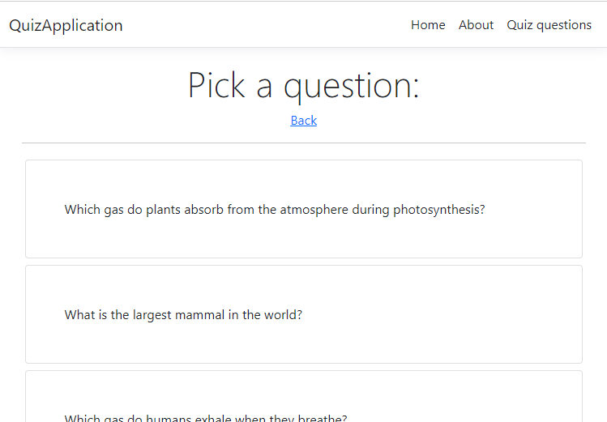
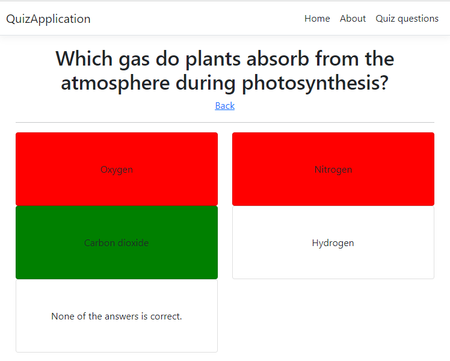
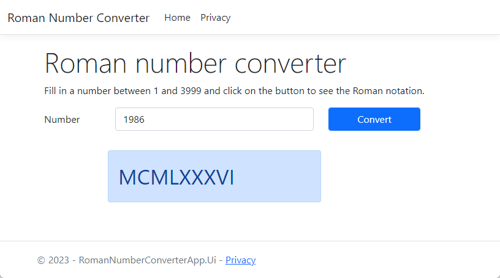

# Exercises - Part 2 - ASP.NET Core MVC + Entity Framework + NUnit

## MVC & Entity Framework - Quiz Application
In this MVC web app we will make a website that contains questions for a quiz. The questions are sorted in categories and for each question multiple correct and incorrect answers are given. 

The solution contains a [layered architecture](https://www.oreilly.com/library/view/software-architecture-patterns/9781491971437/ch01.html) (see Programming Advanced next semester!) containing 5 projects:

* **AppLogic**: this project contains the application/'business' logic of the webapp. In the folder Contracts you can find the interfaces that are used in the application. 
QuizService is an important class as it will be used by the controllers in the MVC WebApp to get the necessary data.

* **Domain**: Answer, Question and Category are the domain classes of this solution. 
* **Infrastructure**: This project contains the *implementation* of the repositories and DbContext of the application. In these repositories an actual database should be used for the questions and answers. The categories are saved in an in-memory list. 
* **Tests**: The GUTS unit (and integration) tests.
* **Web**: The .NET Core MVC project that should generate the website by using MVC and the Domain and AppLogic (QuizService) projects.

When the website is visited and the user clicks on 'Quiz questions', the following page should show: 

The categories are fetched from an in-memory repository containing the categories.

After selecting a category:

The questions are fetched from a SQL Server using Entity Framework. 

Finally, after clicking a question this page is shown:

The user can click on answers and the color indicates if the guess was correct.
Important: the last answer **'None of the answers is correct.'** is not present in the dataset/database and should be **generated** in the service that is responsible for providing the questions and answers (QuizService).

**Let the automatic tests guide you into understanding the intent of the code and into completing the code.**

## NUnit - Roman number converter
Make an application that converts numbers to there Roman notation:

You can type a number in an input field and click on the *Convert* button. This results in the equivalent Roman number being shown. 

Roman numbers must be in the range from 1 to 3999. If a number out of range is converted an error message is shown:

The *Controller* action methods are already implemented (*Home, Index*). The matching view is also already implemented.
What you need to do is to implement the *Convert* method of the *RomanNumberConverter* in the *Models* folder and write the necessary unit tests that verifies the implementation of the *Convert* method. 

Complete the *RomanNumberConverterTests* class (in the test project) by implementing the following tests:

* Convert_ValueIsNotBetweenOneAnd3999_ShouldThrowArgumentException
     * It is only possible to covert numbers between 1 and 3999. When the number to convert is out of bounds, an *ArgumentException* with the message *"Out of Roman range (1-3999)"* should be thrown. 
     * Define some test cases (2 or more). At least one test case for a value that is too small and at least one test case for a value that is too big.
* Convert_ValidValue_ShouldReturnRomanNumberEquivalent
     * Define some test castes (4 or more) to test a valid conversion. 
     * You can use the following (recursive) algorithm to implement the conversion:
          * If *number >= 1000* the result is *M* followed by the conversion of *number - 1000*. 
          * If *number >= 900* the result is *CM* followed by the conversion of *number - 900*. 
          * If *number >= 500* the result is *D* followed by the conversion of *number - 500*. 
          * If *number >= 400* the result is *CD* followed by the conversion of *number - 400*. 
          * If *number >= 100* the result is *C* followed by the conversion of *number - 100*. 
          * If *number >= 90* the result is *XC* followed by the conversion of *number - 90*. 
          * If *number >= 50* the result is *L* followed by the conversion of *number - 50*. 
          * If *number >= 40* the result is *XL* followed by the conversion of *number - 40*. 
          * If *number >= 10* the result is *X* followed by the conversion of *number - 10*. 
          * If *number >= 9* the result is *IX* followed by the conversion of *number - 9*. 
          * If *number >= 5* the result is *V* followed by the conversion of *number - 5*. 
          * If *number >= 4* the result is *IV* followed by the conversion of *number - 4*. 
          * If *number >= 1* the result is *I* followed by the conversion of *number - 1*.

Write the test first and then try to make it green by altering the production code.
Use a setup method.